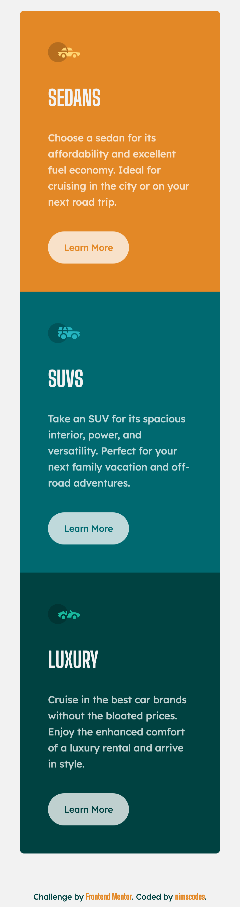
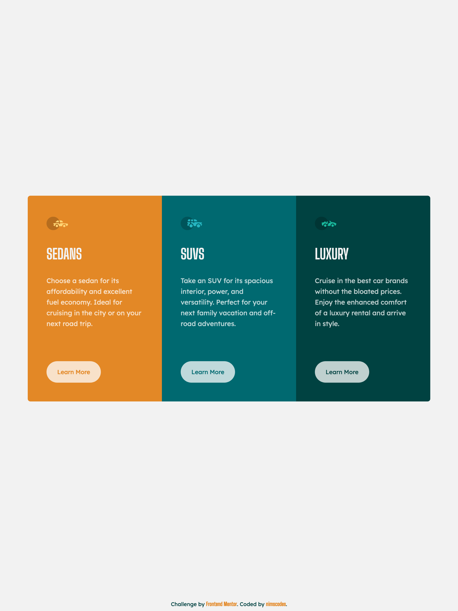

# Frontend Mentor - 3-column preview card component solution

This is a solution to the [3-column preview card component challenge on Frontend Mentor](https://www.frontendmentor.io/challenges/3column-preview-card-component-pH92eAR2-). Frontend Mentor challenges help you improve your coding skills by building realistic projects. 

## Table of contents

- [Overview](#overview)
  - [The challenge](#the-challenge)
  - [Screenshot](#screenshot)
  - [Links](#links)
- [My process](#my-process)
  - [Built with](#built-with)
  - [What I learned](#what-i-learned)
  - [Continued development](#continued-development)
  - [Useful resources](#useful-resources)
- [Author](#author)


## Overview

### The challenge

Users should be able to:

- View the optimal layout depending on their device's screen size
- See hover states for interactive elements

### Screenshot
Mobile View


Desktop View



### Links

- Solution URL: [github.com/nimscodes/3-CPCM](https://github.com/nimscodes/3-CPCM)
- Live Site URL: [nimscodes.github.io/3-CPCM/](https://nimscodes.github.io/3-CPCM/)

## My process

### Built with

- Semantic HTML5 markup
- CSS custom properties
- Flexbox
- Mobile-first workflow


### What I learned

I learnt how to center a div in many ways but implemented the flex box model solution

To see demonstration, see below:

```html
<body>
  <div class="parent">
    <div class="child">
      Center Me
    </div>
  </div>
</body>
```
```css
html, body { height: 100%; }

.parent {
  height: 200px;
  background: gray;
  display: flex;
  align-items: center;
  justify-content: center;
}

.child {
  background-color: orange;
  width: 100px;
  height: 100px;
}
```

### Continued development

This challenge was prely built using the flexbox model and I am looking forward to mastering this concept by working on simlar projects


### Useful resources

- [11 Ways to Center Div or Text in Div in CSS](https://blog.hubspot.com/website/center-div-css) - This helped me center the cards container. I really liked this pattern and will use it going forward.

## Author

- Website - [Prince Andrews Nimako](https://nimscodes.vercel.app/)
- Frontend Mentor - [@nimscodes](https://www.frontendmentor.io/profile/nimscodes)


